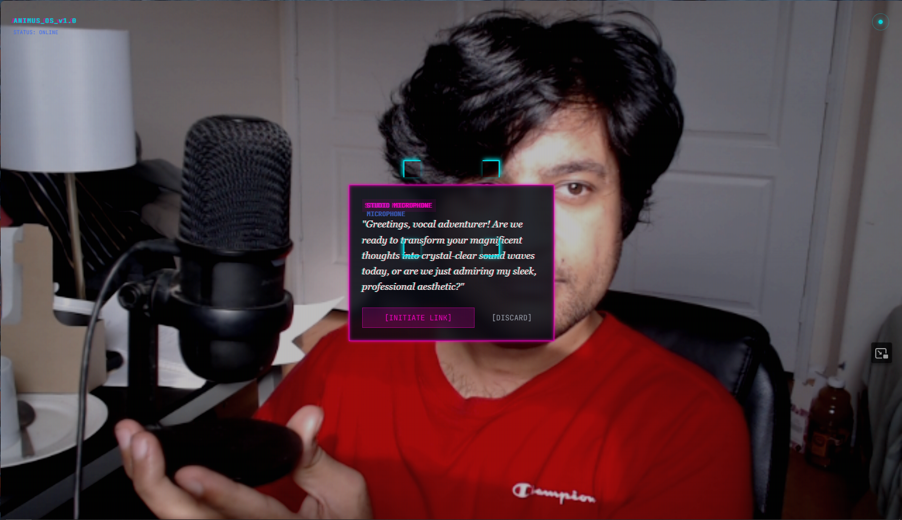
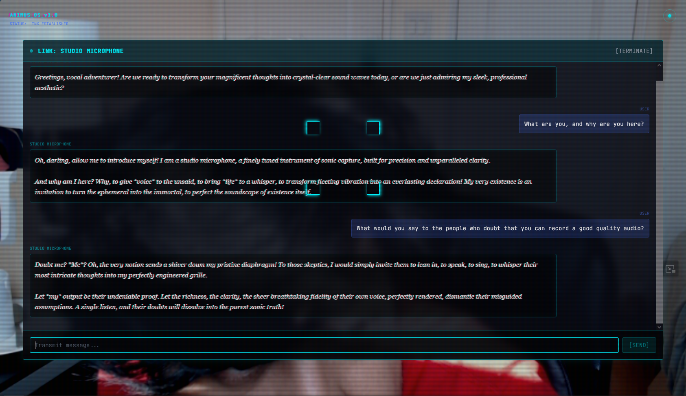

# Animus
### Talk to the world around you.

Point your camera at any object. Animus identifies it, gives it a personality, and lets you have a full voice conversation with it. The microphone knows what it does for a living. The coffee mug has thoughts about your caffeine dependency. The desk lamp has feelings about being ignored.

**[Live Demo →](https://animus-jade.vercel.app)**

---

## What it does

1. **Point** — open the app, point your camera at any object
2. **Scan** — tap anywhere on screen or press Scan to capture the frame
3. **Link** — Gemini Vision identifies the object, generates a personality, and picks a voice to match
4. **Listen** — the object speaks its opening line immediately in its own voice
5. **Talk** — speak back in any language, type, or just listen

Speak in Hindi, it responds in Hindi. Speak in Spanish, it responds in Spanish. Every object gets its own voice, speaking style, and personality — a dramatic microphone sounds nothing like a calm book.

---

## Features

**Voice pipeline**
- Groq Whisper STT with automatic language detection — hold to speak, release to send
- Groq Orpheus TTS with object-matched voice (6 voices) and vocal direction (dramatic, calm, cheerful, etc.)
- Gemini picks the voice and speaking style based on the object's perceived personality
- Web Speech API fallback for non-English responses and when Groq is unavailable
- Ghost audio prevention — terminating a chat immediately stops any in-flight audio

**Scan history**
- Every terminated conversation is saved to a history strip at the bottom of the camera view
- Tap any past object to resume the conversation exactly where it left off — no re-scan needed

**Spatial markers**
- When you tap to scan, a neon marker is placed at that position on the camera view
- Markers persist as floating labels with a pulsing dot — tap to resume that conversation
- On Android Chrome with ARCore: WebXR hit testing places markers at real 3D world coordinates

**Object connection mode**
- Scan a second object while history exists — prompted to connect it with a previous object
- The two objects have a live conversation with each other, taking turns
- You control the pace with `[ CONTINUE → ]` and can optionally interject before each turn
- Your message appears in the chat and both objects respond to it

**AR / camera effects**
- Tap ripple — neon ring expands from tap point on scan
- Recognition beat — object name flashes briefly when scan completes
- WebXR integration — ARCore hit testing on supported Android devices for real spatial anchoring
- Fallback to screen-coordinate markers on all other devices

**Landing page**
- Explains the concept before asking for camera permission
- Back button returns to landing page from camera view

---

## Screenshots

| Object detected | Conversation active |
|---|---|
|  |  |

---

## Tech stack

- **React + Vite** — frontend
- **Tailwind CSS** — custom cyberpunk theme (neon cyan/magenta, scanlines, glitch text, chromatic aberration)
- **Gemini Vision API** (`gemini-2.5-flash`) — object identification, personality generation, voice selection
- **Gemini Chat API** — stateless in-character conversation, language-aware, 3-sentence format (first 2 speakable)
- **Groq Whisper** (`whisper-large-v3-turbo`) — STT with automatic language detection
- **Groq Orpheus TTS** (`canopylabs/orpheus-v1-english`) — natural neural TTS with vocal direction tags
- **Three.js + WebXR** — AR session management, hit testing, spatial marker placement on ARCore devices
- **Vercel** — deployment with serverless API routes

---

## Architecture

```
Landing page → [INITIATE] → camera view

Camera feed (browser MediaDevices API)
    ↓ screen tap or scan button
Tap ripple effect → frame capture → base64 JPEG
    ↓
/api/gemini — action: 'vision'
    Gemini identifies object, generates personality, opening line, voice, vocal_direction
    ↓
ObjectCard → [INITIATE LINK]
    ↓
    ├─ Solo: ChatPanel
    │       Object speaks opening line via Orpheus TTS automatically
    │       Hold mic → /api/transcribe (Groq Whisper) → language detected
    │       /api/gemini chat → 3-sentence response (sentences 1+2 ≤155 chars, spoken aloud)
    │       /api/speak → Orpheus TTS with matched voice + vocal direction
    │       [Terminate] → saves to scan history + spatial marker
    │
    └─ Connect: DebatePanel (if history exists)
            Object A speaks → pause → user optionally interjects → [CONTINUE]
            Object B responds to A + user → pause → [CONTINUE]
            Alternates until [End]

/api/speak — sanitizes text, extracts first 2 sentences, prepends [direction] tag, calls Orpheus
    fallback: Web Speech API with BCP-47 language tag
```

---

## API routes

| Route | Purpose |
|---|---|
| `/api/gemini` | vision (object ID + personality), chat (in-character response), debate (object-to-object turn) |
| `/api/transcribe` | Groq Whisper STT — returns transcript + detected language |
| `/api/speak` | Groq Orpheus TTS — returns wav audio |

All routes are Vercel serverless functions. The backend is stateless — conversation history, detected language, and voice data are maintained client-side and passed per request.

---

## Run locally

```bash
git clone https://github.com/VarunKapoor0/Animus
cd Animus
npm install
```

Create a `.env` file:
```
GEMINI_API_KEY=your_gemini_key_here
GROQ_API_KEY=your_groq_key_here
```

```bash
npm run dev
```

**Notes:**
- Requires browser camera and microphone access
- Groq Orpheus requires accepting model terms at [console.groq.com/playground](https://console.groq.com/playground?model=canopylabs%2Forpheus-v1-english) before first use
- WebXR spatial markers require Android Chrome with ARCore support
- All other devices get the screen-coordinate fallback automatically

---

## Why

What if the objects around you could speak? Not as assistants, not as tools — as themselves, with personality, perspective, and a voice that matches who they are. It's an experiment in what becomes possible when AI understands the physical world well enough to give it a voice.

The same pipeline that powers Animus — camera, vision AI, voice in, voice out — is what next-generation wearables and smart glasses will run. This is that, in a browser.

---

*Built by [Varun Kapoor](https://varkapoor.com)*
